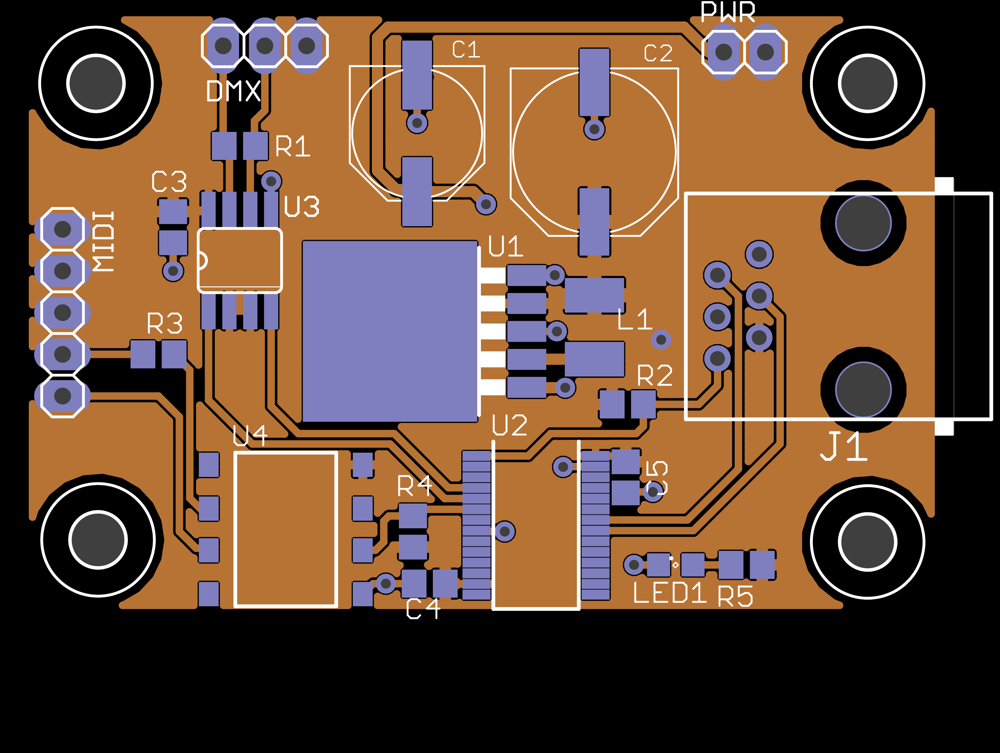
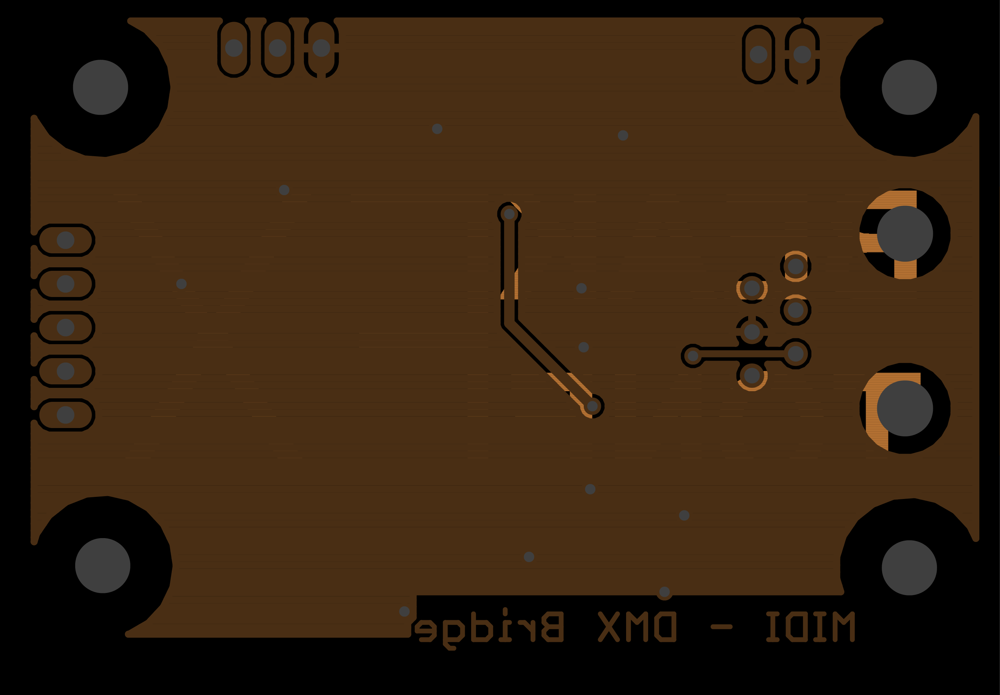

gerber-tools
============
 

Tools to handle Gerber and Excellon files in Python.

Example:

    import gerber
    from gerber.render import GerberSvgContext

    # Read gerber and Excellon files
    top_copper = gerber.read('example.GTL')
    nc_drill = gerber.read('example.txt')

    # Rendering context
    ctx = GerberSvgContext()

    # Create SVG image
    top_copper.render(ctx)
    nc_drill.render(ctx, 'composite.svg')

Rendering:

