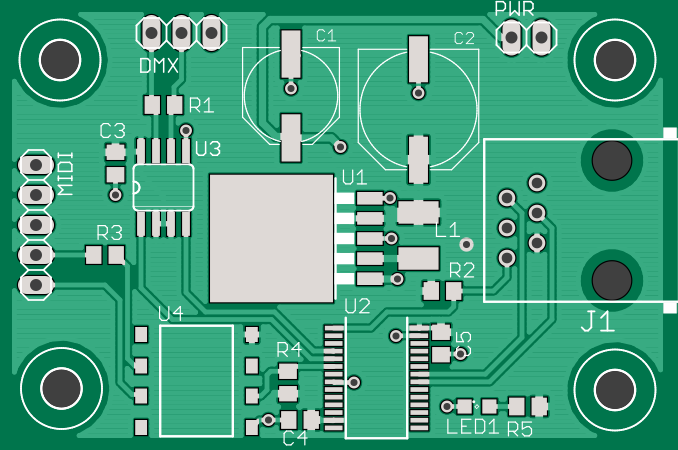

pcb-tools
============
[](https://travis-ci.org/curtacircuitos/pcb-tools)
[](https://coveralls.io/r/curtacircuitos/pcb-tools?branch=master)
[](https://readthedocs.org/projects/pcb-tools/?badge=latest)

Tools to handle Gerber and Excellon files in Python.

Usage Example:
---------------
    import gerber
    from gerber.render import GerberCairoContext

    # Read gerber and Excellon files
    top_copper = gerber.read('example.GTL')
    nc_drill = gerber.read('example.txt')

    # Rendering context
    ctx = GerberCairoContext()

    # Create SVG image
    top_copper.render(ctx)
    nc_drill.render(ctx, 'composite.svg')


Rendering Examples:
-------------------
### Top Composite rendering



Source code for this example can be found [here](examples/cairo_example.py).


Install from source:
```
$ git clone https://github.com/curtacircuitos/pcb-tools.git
$ cd pcb-tools
$ pip install -r requirements.txt
$ python setup.py install
```

Documentation:
--------------
[PCB Tools Documentation](http://pcb-tools.readthedocs.org/en/latest/)


Development and Testing:
------------------------

Dependencies for developing and testing pcb-tools are listed in test-requirements.txt. Use of a virtual environment is strongly recommended.

    $ virtualenv venv
    $ source venv/bin/activate
    (venv)$ pip install -r test-requirements.txt
    (venv)$ pip install -e .

We use nose to run pcb-tools's suite of unittests and doctests.

    (venv)$ nosetests
